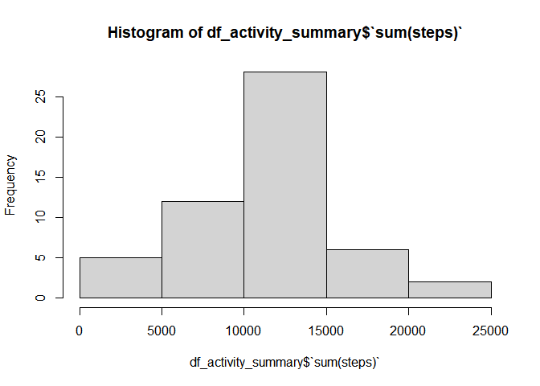
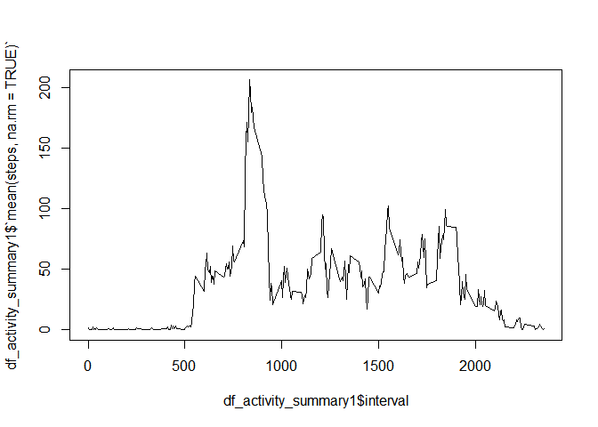
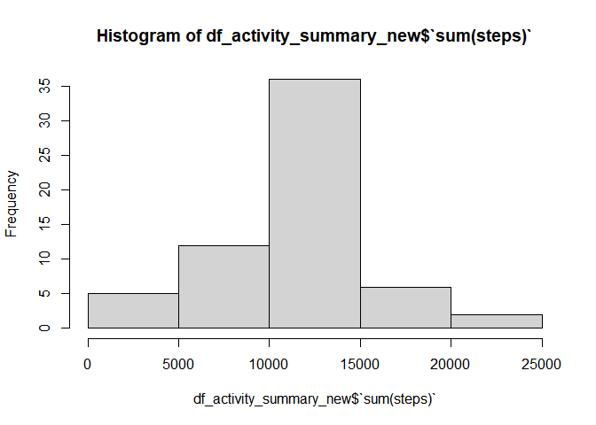
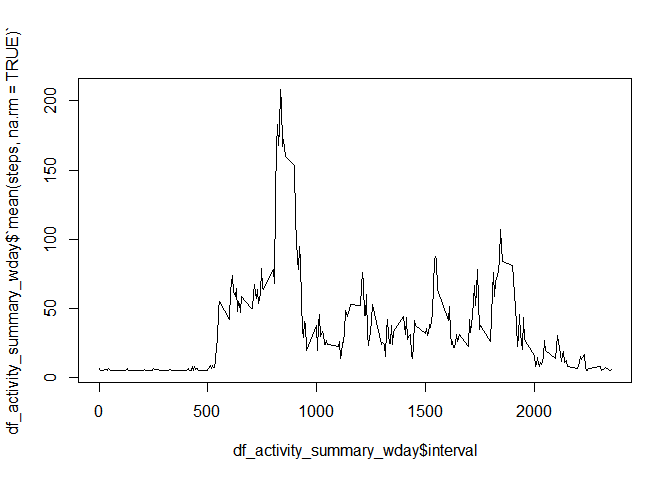
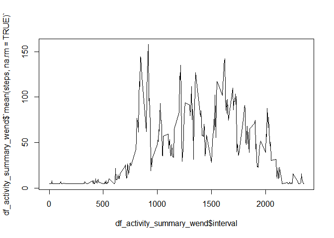

## Loading and preprocessing the data

```r
library(dplyr)
```

```
## 
## Attaching package: 'dplyr'
```

```
## The following objects are masked from 'package:stats':
## 
##     filter, lag
```

```
## The following objects are masked from 'package:base':
## 
##     intersect, setdiff, setequal, union
```

```r
df_activity <- read.csv("activity.csv", header = TRUE)

df_activity_group_by_date <- group_by(df_activity, date)

df_activity_summary <- summarise(df_activity_group_by_date, sum(steps))
```


## What is mean total number of steps taken per day?

```r
hist(df_activity_summary$`sum(steps)`)
```

<!-- -->

## Average of number of steps taken per day

```r
average_steps <- mean(df_activity_summary$`sum(steps)`, na.rm=TRUE)
average_steps
```

```
## [1] 10766.19
```

## median of  number of steps taken per day

```r
median_steps <- median(df_activity_summary$`sum(steps)`, na.rm=TRUE)
median_steps
```

```
## [1] 10765
```


## What is the average daily activity pattern?


```r
df_activity_group_by_interval <- group_by(df_activity, interval)

df_activity_summary1 <- summarise(df_activity_group_by_interval, mean(steps, na.rm = TRUE))

plot(df_activity_summary1$interval, df_activity_summary1$`mean(steps, na.rm = TRUE)`, type = "l")
```

<!-- -->

## Imputing missing values

```r
total_nas <- sum(is.na(df_activity$steps))
total_nas
```

```
## [1] 2304
```

```r
df_activity_new <- df_activity

interval_mean <- mean(df_activity$steps, na.rm=TRUE)

df_activity_new$steps[is.na(df_activity_new$steps)] = interval_mean

df_activity_group_by_date_new <- group_by(df_activity_new, date)

df_activity_summary_new <- summarise(df_activity_group_by_date_new, sum(steps))


hist(df_activity_summary_new$`sum(steps)`)
```

<!-- -->

## Average after Imputing NAs

```r
average_new <-  mean(df_activity_summary_new$`sum(steps)`, na.rm=TRUE)
average_new
```

```
## [1] 10766.19
```
  
  

## Median after imputing NAs.

```r
median_new <-  median(df_activity_summary_new$`sum(steps)`, na.rm=TRUE)
median_new
```

```
## [1] 10766.19
```


## Are there differences in activity patterns between weekdays and weekends?

```r
library(timeDate)
```

```
## Warning: package 'timeDate' was built under R version 4.0.4
```

```r
df_activity_with_days <- mutate(df_activity_new, is_weekday=isWeekday(df_activity_new$date,wday=1:5) )

df_activity_with_weekdays <- filter(df_activity_with_days, is_weekday==TRUE)
df_activity_with_weekends  <- filter(df_activity_with_days, is_weekday==FALSE)

df_activity_group_by_interval_wday <- group_by(df_activity_with_weekdays, interval)
df_activity_group_by_interval_wend <- group_by(df_activity_with_weekends, interval)


df_activity_summary_wday <- summarise(df_activity_group_by_interval_wday, mean(steps, na.rm = TRUE))
df_activity_summary_wend <- summarise(df_activity_group_by_interval_wend, mean(steps, na.rm = TRUE))
```

## plot for weekdays

```r
plot(df_activity_summary_wday$interval   , df_activity_summary_wday$`mean(steps, na.rm = TRUE)`  , type = "l")
```

<!-- -->

## plot for weeends

```r
plot(df_activity_summary_wend$interval   , df_activity_summary_wend$`mean(steps, na.rm = TRUE)`  , type = "l")
```

<!-- -->


